# 📐 Diagrams (InternPath)

> ชุด Diagram สำหรับอ่านประกอบเอกสาร — **Use Case • Sequence • Class • ER**
> แหล่งข้อมูลจริงยังเป็น [data-schema.md](data-schema.md) (ตาราง/Enum/State Machine), [api-contract.md](api-contract.md) (Endpoint), [event-contract.md](event-contract.md) (Event) — ถ้า Diagram ขัดกับเอกสารเหล่านั้น ให้ยึดเอกสารต้นทาง แล้วแก้ Diagram
> เขียนด้วย Mermaid: GitHub แสดงผลให้อัตโนมัติ • ใน VS Code ต้องเปิดด้วย Markdown Preview ที่รองรับ Mermaid

| # | หัวข้อ | Diagram |
| :-: | :--- | :--- |
| 1 | [Use Case](#1-use-case-diagram) | 1.1 นักศึกษา • 1.2 HR • 1.3 อาจารย์ • 1.4 Admin • 1.5 ระบบและบุคคลทั่วไป |
| 2 | [Sequence](#2-sequence-diagram) | 2.1 ประกาศงาน+ตรวจสอบ • 2.2 ใบสมัครจนเริ่มฝึก • 2.3 ประเมิน/โต้แย้ง/ใบรับรอง • 2.4 รีวิว |
| 3 | [Class](#3-class-diagram) | 3.1 Identity • 3.2 Job+Verification • 3.3 Lifecycle |
| 4 | [ER](#4-er-diagram) | 4.0 อ้างอิงข้าม Service • 4.1 Identity • 4.2 Job • 4.3 Verification • 4.4 Lifecycle • 4.5 Notification+ตารางร่วม |

**ข้อตกลงการอ่าน:** 1 DB ต่อ Service — ไม่มี FK ข้าม DB, อ้างด้วย `id` เท่านั้น (เส้นประ `..` ใน ER และ `..>` ใน Class = อ้างอิงเชิงตรรกะ ไม่ใช่ FK)

---

## 1. Use Case Diagram

เส้นทึบ = ผู้ใช้ทำได้ • เส้นประ `include`/`extend` = ความสัมพันธ์ระหว่าง Use Case • Role อ้างอิงตาม `Role` ใน [data-schema.md §2.1](data-schema.md)

### 1.1 นักศึกษา (`STUDENT`)

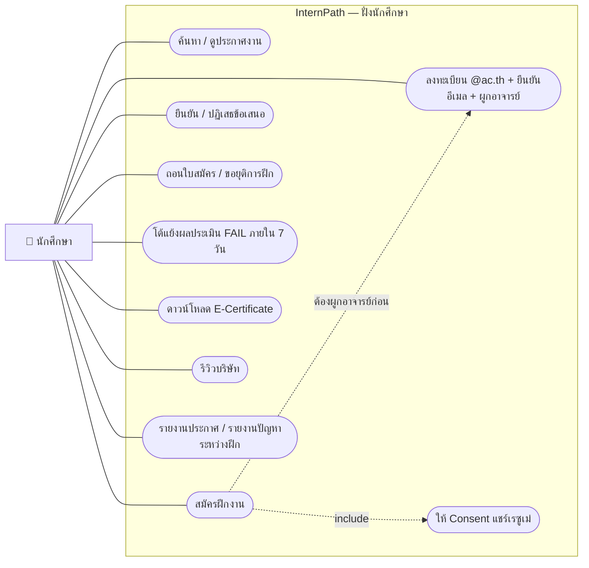
```mermaid
flowchart LR
    S["👤 นักศึกษา"]

    subgraph SYS["InternPath — ฝั่งนักศึกษา"]
        direction TB
        U1(["ลงทะเบียน @ac.th + ยืนยันอีเมล + ผูกอาจารย์"])
        U2(["ค้นหา / ดูประกาศงาน"])
        U3(["สมัครฝึกงาน"])
        U3a(["ให้ Consent แชร์เรซูเม่"])
        U4(["ยืนยัน / ปฏิเสธข้อเสนอ"])
        U5(["ถอนใบสมัคร / ขอยุติการฝึก"])
        U6(["โต้แย้งผลประเมิน FAIL ภายใน 7 วัน"])
        U7(["ดาวน์โหลด E-Certificate"])
        U8(["รีวิวบริษัท"])
        U9(["รายงานประกาศ / รายงานปัญหาระหว่างฝึก"])
    end

    S --- U1
    S --- U2
    S --- U3
    S --- U4
    S --- U5
    S --- U6
    S --- U7
    S --- U8
    S --- U9
    U3 -.->|include| U3a
    U3 -.->|ต้องผูกอาจารย์ก่อน| U1
```

### 1.2 HR บริษัท (`COMPANY_HR`)

Owner เป็นสมาชิก HR ที่มีสิทธิ์เพิ่ม (`HO` ใน API) — แสดงด้วยการสืบทอดสิทธิ์

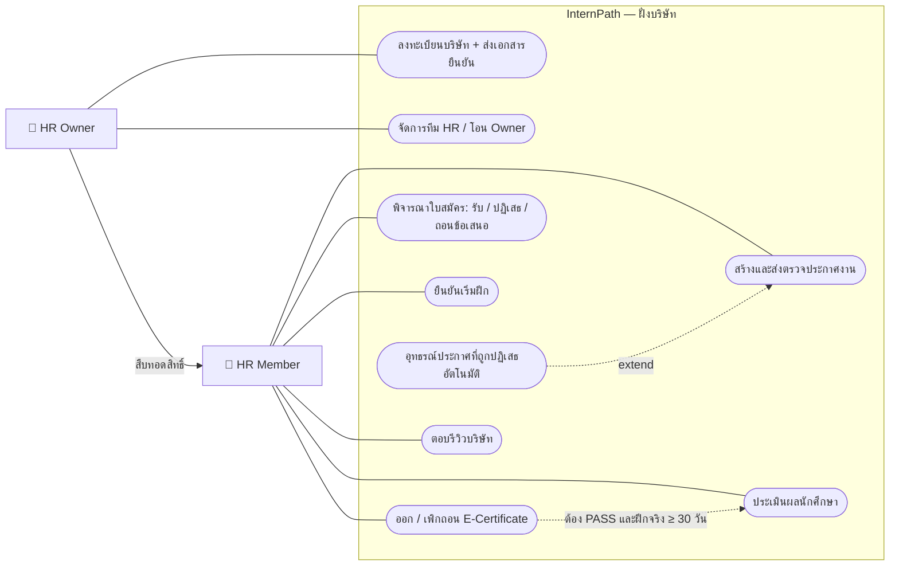
```mermaid
flowchart LR
    H["👤 HR Member"]
    O["👤 HR Owner"]
    O -->|สืบทอดสิทธิ์| H

    subgraph SYS["InternPath — ฝั่งบริษัท"]
        direction TB
        C1(["ลงทะเบียนบริษัท + ส่งเอกสารยืนยัน"])
        C2(["จัดการทีม HR / โอน Owner"])
        J1(["สร้างและส่งตรวจประกาศงาน"])
        J2(["อุทธรณ์ประกาศที่ถูกปฏิเสธอัตโนมัติ"])
        A1(["พิจารณาใบสมัคร: รับ / ปฏิเสธ / ถอนข้อเสนอ"])
        A2(["ยืนยันเริ่มฝึก"])
        A3(["ประเมินผลนักศึกษา"])
        A4(["ออก / เพิกถอน E-Certificate"])
        A5(["ตอบรีวิวบริษัท"])
    end

    O --- C1
    O --- C2
    H --- J1
    H --- A1
    H --- A2
    H --- A3
    H --- A4
    H --- A5
    J2 -.->|extend| J1
    A4 -.->|ต้อง PASS และฝึกจริง ≥ 30 วัน| A3
```

### 1.3 อาจารย์ที่ปรึกษา (`ADVISOR`)

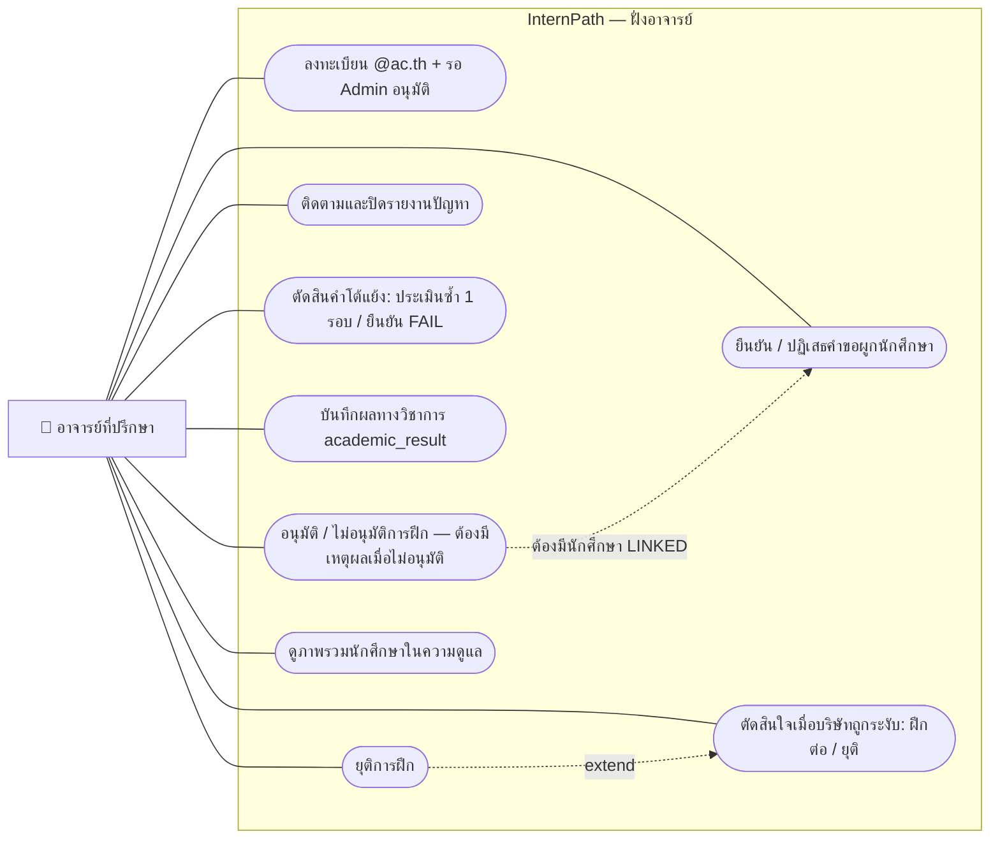
```mermaid
flowchart LR
    A["👤 อาจารย์ที่ปรึกษา"]

    subgraph SYS["InternPath — ฝั่งอาจารย์"]
        direction TB
        V1(["ลงทะเบียน @ac.th + รอ Admin อนุมัติ"])
        V2(["ยืนยัน / ปฏิเสธคำขอผูกนักศึกษา"])
        V3(["อนุมัติ / ไม่อนุมัติการฝึก — ต้องมีเหตุผลเมื่อไม่อนุมัติ"])
        V4(["ติดตามและปิดรายงานปัญหา"])
        V5(["ตัดสินคำโต้แย้ง: ประเมินซ้ำ 1 รอบ / ยืนยัน FAIL"])
        V6(["บันทึกผลทางวิชาการ academic_result"])
        V7(["ตัดสินใจเมื่อบริษัทถูกระงับ: ฝึกต่อ / ยุติ"])
        V8(["ยุติการฝึก"])
        V9(["ดูภาพรวมนักศึกษาในความดูแล"])
    end

    A --- V1
    A --- V2
    A --- V3
    A --- V4
    A --- V5
    A --- V6
    A --- V7
    A --- V9
    V8 -.->|extend| V7
    A --- V8
    V3 -.->|ต้องมีนักศึกษา LINKED| V2
```

### 1.4 ผู้ดูแลแพลตฟอร์ม (`PLATFORM_ADMIN`)

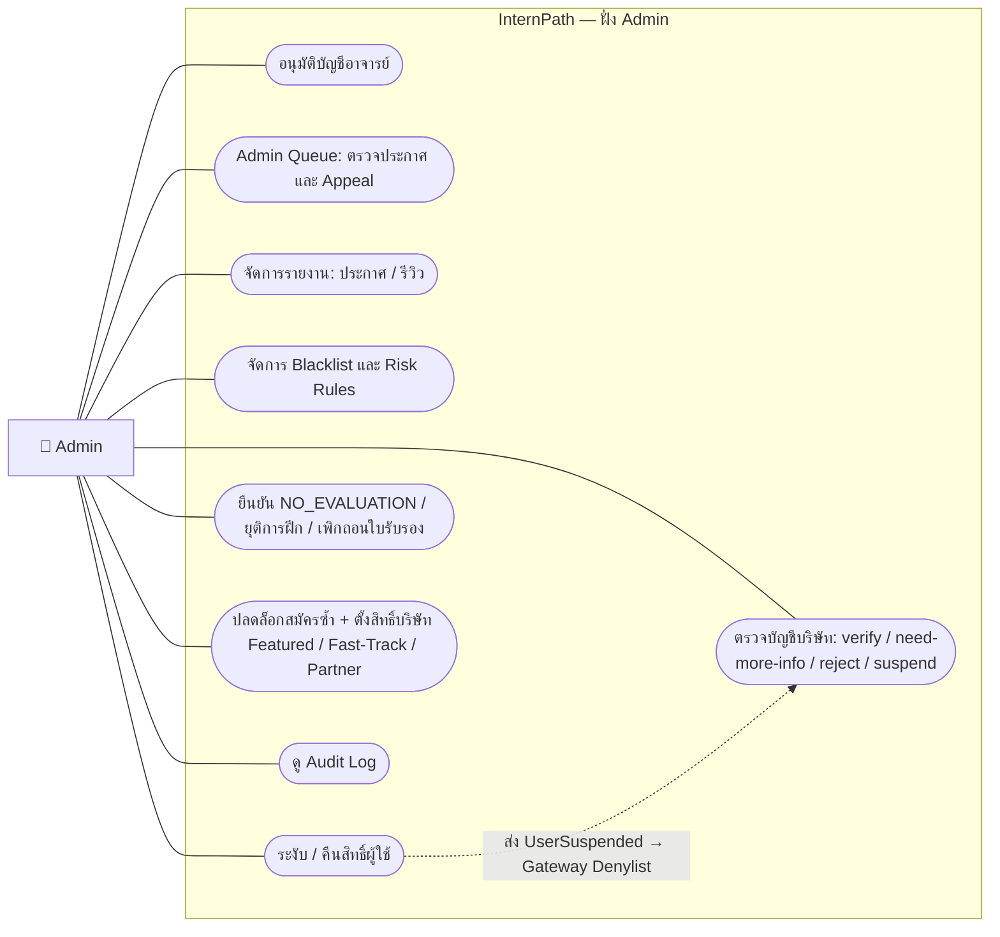
```mermaid
flowchart LR
    AD["👤 Admin"]

    subgraph SYS["InternPath — ฝั่ง Admin"]
        direction TB
        D1(["ตรวจบัญชีบริษัท: verify / need-more-info / reject / suspend"])
        D2(["อนุมัติบัญชีอาจารย์"])
        D3(["Admin Queue: ตรวจประกาศ และ Appeal"])
        D4(["จัดการรายงาน: ประกาศ / รีวิว"])
        D5(["จัดการ Blacklist และ Risk Rules"])
        D6(["ระงับ / คืนสิทธิ์ผู้ใช้"])
        D7(["ยืนยัน NO_EVALUATION / ยุติการฝึก / เพิกถอนใบรับรอง"])
        D8(["ปลดล็อกสมัครซ้ำ + ตั้งสิทธิ์บริษัท Featured / Fast-Track / Partner"])
        D9(["ดู Audit Log"])
    end

    AD --- D1
    AD --- D2
    AD --- D3
    AD --- D4
    AD --- D5
    AD --- D6
    AD --- D7
    AD --- D8
    AD --- D9
    D6 -.->|ส่ง UserSuspended → Gateway Denylist| D1
```

### 1.5 ระบบอัตโนมัติ และบุคคลทั่วไป

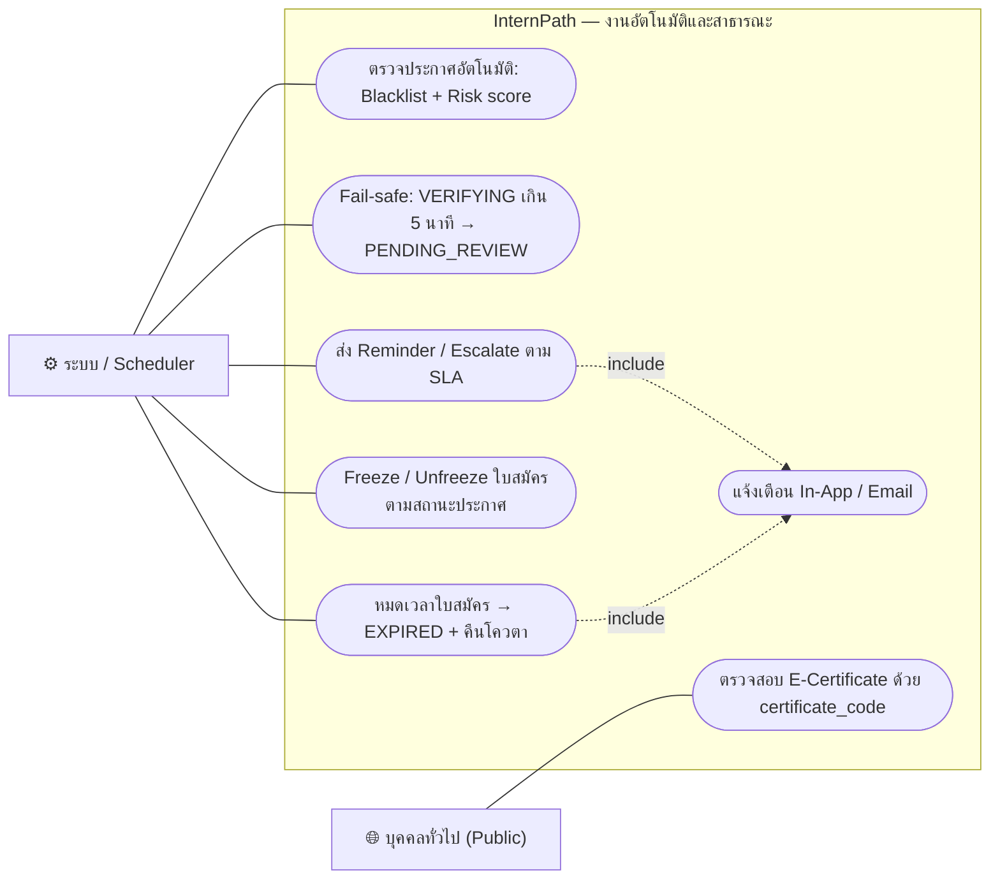
```mermaid
flowchart LR
    SY["⚙️ ระบบ / Scheduler"]
    P["🌐 บุคคลทั่วไป (Public)"]

    subgraph SYS["InternPath — งานอัตโนมัติและสาธารณะ"]
        direction TB
        Y1(["ตรวจประกาศอัตโนมัติ: Blacklist + Risk score"])
        Y2(["Fail-safe: VERIFYING เกิน 5 นาที → PENDING_REVIEW"])
        Y3(["หมดเวลาใบสมัคร → EXPIRED + คืนโควตา"])
        Y4(["Freeze / Unfreeze ใบสมัครตามสถานะประกาศ"])
        Y5(["ส่ง Reminder / Escalate ตาม SLA"])
        Y6(["แจ้งเตือน In-App / Email"])
        Y7(["ตรวจสอบ E-Certificate ด้วย certificate_code"])
    end

    SY --- Y1
    SY --- Y2
    SY --- Y3
    SY --- Y4
    SY --- Y5
    Y5 -.->|include| Y6
    Y3 -.->|include| Y6
    P --- Y7
```

---

## 2. Sequence Diagram

ลูกศร `->>` = เรียกแบบ Synchronous (HTTP) • `-)` = ส่ง Event ผ่าน RabbitMQ (Asynchronous, at-least-once) — ตาม [event-contract.md](event-contract.md)

### 2.1 ประกาศงาน: ส่งตรวจ → เผยแพร่ / ตีกลับ

Event ที่เกี่ยวข้อง: `JobSubmitted` (E01), `JobVerified` (E02), `JobStatusChanged` (E03) • สถานะดู [data-schema.md §8.2](data-schema.md)

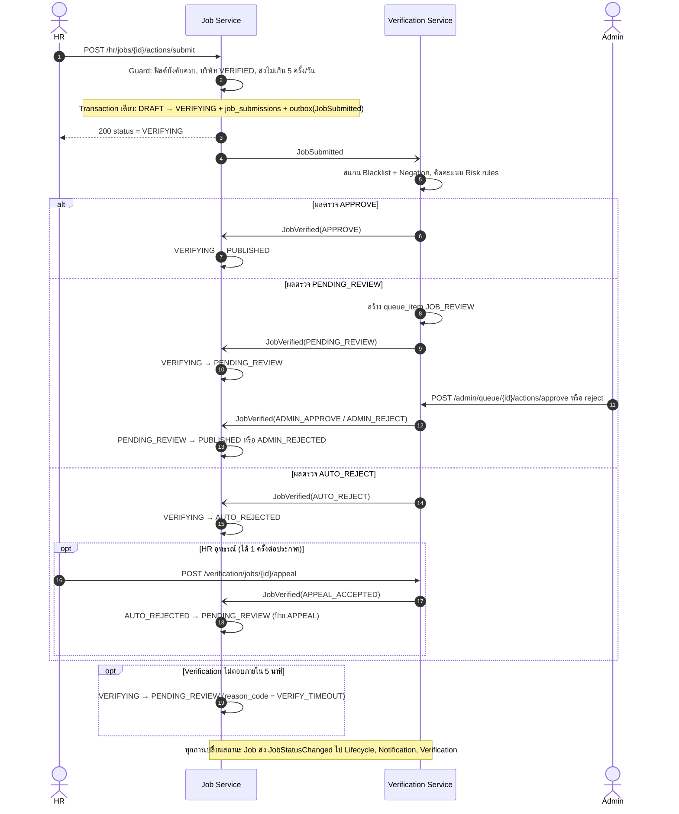
```mermaid
sequenceDiagram
    autonumber
    actor HR as HR
    participant Job as Job Service
    participant Ver as Verification Service
    actor Admin as Admin

    HR->>Job: POST /hr/jobs/{id}/actions/submit
    Job->>Job: Guard: ฟิลด์บังคับครบ, บริษัท VERIFIED, ส่งไม่เกิน 5 ครั้ง/วัน
    Note over Job: Transaction เดียว: DRAFT → VERIFYING + job_submissions + outbox(JobSubmitted)
    Job-->>HR: 200 status = VERIFYING
    Job-)Ver: JobSubmitted
    Ver->>Ver: สแกน Blacklist + Negation, คิดคะแนน Risk rules

    alt ผลตรวจ APPROVE
        Ver-)Job: JobVerified(APPROVE)
        Job->>Job: VERIFYING → PUBLISHED
    else ผลตรวจ PENDING_REVIEW
        Ver->>Ver: สร้าง queue_item JOB_REVIEW
        Ver-)Job: JobVerified(PENDING_REVIEW)
        Job->>Job: VERIFYING → PENDING_REVIEW
        Admin->>Ver: POST /admin/queue/{id}/actions/approve หรือ reject
        Ver-)Job: JobVerified(ADMIN_APPROVE / ADMIN_REJECT)
        Job->>Job: PENDING_REVIEW → PUBLISHED หรือ ADMIN_REJECTED
    else ผลตรวจ AUTO_REJECT
        Ver-)Job: JobVerified(AUTO_REJECT)
        Job->>Job: VERIFYING → AUTO_REJECTED
        opt HR อุทธรณ์ (ได้ 1 ครั้งต่อประกาศ)
            HR->>Ver: POST /verification/jobs/{id}/appeal
            Ver-)Job: JobVerified(APPEAL_ACCEPTED)
            Job->>Job: AUTO_REJECTED → PENDING_REVIEW (ป้าย APPEAL)
        end
    end

    opt Verification ไม่ตอบภายใน 5 นาที
        Job->>Job: VERIFYING → PENDING_REVIEW (reason_code = VERIFY_TIMEOUT)
    end

    Note over Job,Ver: ทุกการเปลี่ยนสถานะ Job ส่ง JobStatusChanged ไป Lifecycle, Notification, Verification
```

### 2.2 ใบสมัคร: สมัคร → HR รับ → นักศึกษายืนยัน → อาจารย์อนุมัติ → เริ่มฝึก

โควตาใช้ `application_id` เป็น Idempotency Key (จอง → ยืนยัน หรือ คืน) • สถานะดู [data-schema.md §8.1](data-schema.md)

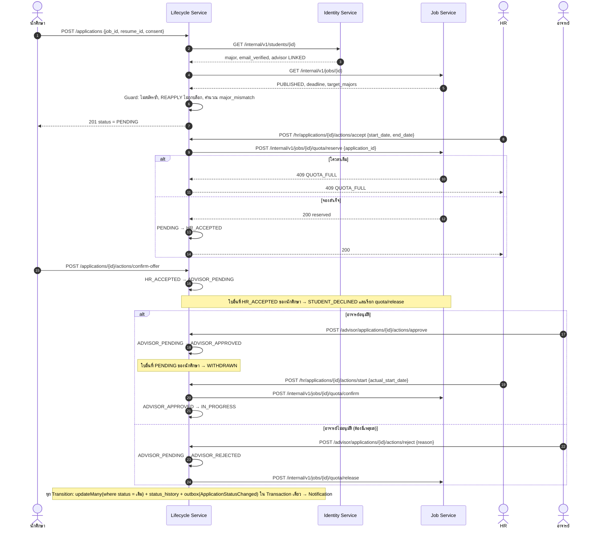
```mermaid
sequenceDiagram
    autonumber
    actor S as นักศึกษา
    participant L as Lifecycle Service
    participant I as Identity Service
    participant J as Job Service
    actor H as HR
    actor A as อาจารย์

    S->>L: POST /applications {job_id, resume_id, consent}
    L->>I: GET /internal/v1/students/{id}
    I-->>L: major, email_verified, advisor LINKED
    L->>J: GET /internal/v1/jobs/{id}
    J-->>L: PUBLISHED, deadline, target_majors
    L->>L: Guard: ไม่สมัครซ้ำ, REAPPLY ไม่ถูกบล็อก, คำนวณ major_mismatch
    L-->>S: 201 status = PENDING

    H->>L: POST /hr/applications/{id}/actions/accept {start_date, end_date}
    L->>J: POST /internal/v1/jobs/{id}/quota/reserve {application_id}
    alt โควตาเต็ม
        J-->>L: 409 QUOTA_FULL
        L-->>H: 409 QUOTA_FULL
    else จองสำเร็จ
        J-->>L: 200 reserved
        L->>L: PENDING → HR_ACCEPTED
        L-->>H: 200
    end

    S->>L: POST /applications/{id}/actions/confirm-offer
    L->>L: HR_ACCEPTED → ADVISOR_PENDING
    Note over L,J: ใบอื่นที่ HR_ACCEPTED ของนักศึกษา → STUDENT_DECLINED และเรียก quota/release

    alt อาจารย์อนุมัติ
        A->>L: POST /advisor/applications/{id}/actions/approve
        L->>L: ADVISOR_PENDING → ADVISOR_APPROVED
        Note over L: ใบอื่นที่ PENDING ของนักศึกษา → WITHDRAWN
        H->>L: POST /hr/applications/{id}/actions/start {actual_start_date}
        L->>J: POST /internal/v1/jobs/{id}/quota/confirm
        L->>L: ADVISOR_APPROVED → IN_PROGRESS
    else อาจารย์ไม่อนุมัติ (ต้องมีเหตุผล)
        A->>L: POST /advisor/applications/{id}/actions/reject {reason}
        L->>L: ADVISOR_PENDING → ADVISOR_REJECTED
        L->>J: POST /internal/v1/jobs/{id}/quota/release
    end

    Note over L: ทุก Transition: updateMany(where status = เดิม) + status_history + outbox(ApplicationStatusChanged) ใน Transaction เดียว → Notification
```

### 2.3 ประเมินผล → โต้แย้ง → ผลวิชาการ และ E-Certificate

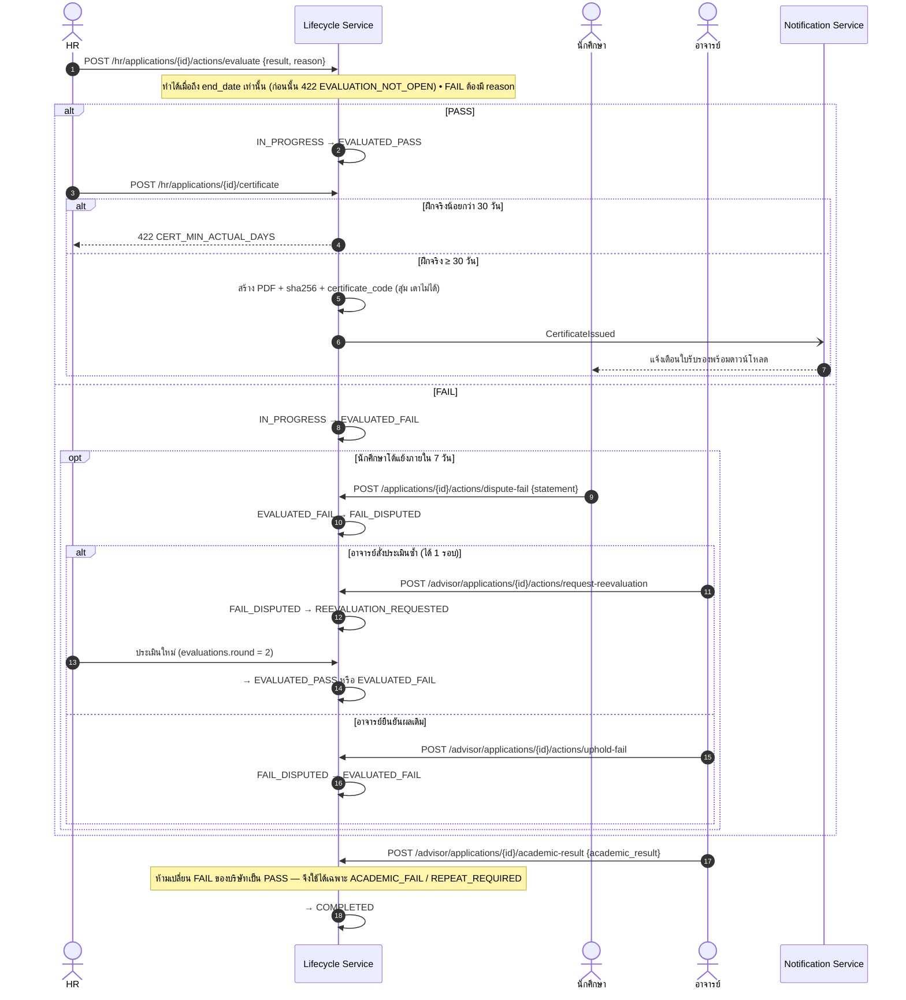
```mermaid
sequenceDiagram
    autonumber
    actor H as HR
    participant L as Lifecycle Service
    actor S as นักศึกษา
    actor A as อาจารย์
    participant N as Notification Service

    H->>L: POST /hr/applications/{id}/actions/evaluate {result, reason}
    Note over L: ทำได้เมื่อถึง end_date เท่านั้น (ก่อนนั้น 422 EVALUATION_NOT_OPEN) • FAIL ต้องมี reason

    alt PASS
        L->>L: IN_PROGRESS → EVALUATED_PASS
        H->>L: POST /hr/applications/{id}/certificate
        alt ฝึกจริงน้อยกว่า 30 วัน
            L-->>H: 422 CERT_MIN_ACTUAL_DAYS
        else ฝึกจริง ≥ 30 วัน
            L->>L: สร้าง PDF + sha256 + certificate_code (สุ่ม เดาไม่ได้)
            L-)N: CertificateIssued
            N-->>S: แจ้งเตือนใบรับรองพร้อมดาวน์โหลด
        end
    else FAIL
        L->>L: IN_PROGRESS → EVALUATED_FAIL
        opt นักศึกษาโต้แย้งภายใน 7 วัน
            S->>L: POST /applications/{id}/actions/dispute-fail {statement}
            L->>L: EVALUATED_FAIL → FAIL_DISPUTED
            alt อาจารย์สั่งประเมินซ้ำ (ได้ 1 รอบ)
                A->>L: POST /advisor/applications/{id}/actions/request-reevaluation
                L->>L: FAIL_DISPUTED → REEVALUATION_REQUESTED
                H->>L: ประเมินใหม่ (evaluations.round = 2)
                L->>L: → EVALUATED_PASS หรือ EVALUATED_FAIL
            else อาจารย์ยืนยันผลเดิม
                A->>L: POST /advisor/applications/{id}/actions/uphold-fail
                L->>L: FAIL_DISPUTED → EVALUATED_FAIL
            end
        end
    end

    A->>L: POST /advisor/applications/{id}/academic-result {academic_result}
    Note over L: ห้ามเปลี่ยน FAIL ของบริษัทเป็น PASS — จึงใช้ได้เฉพาะ ACADEMIC_FAIL / REPEAT_REQUIRED
    L->>L: → COMPLETED
```

### 2.4 รีวิวบริษัท: ตรวจเนื้อหา → เผยแพร่ / พักรอ Admin

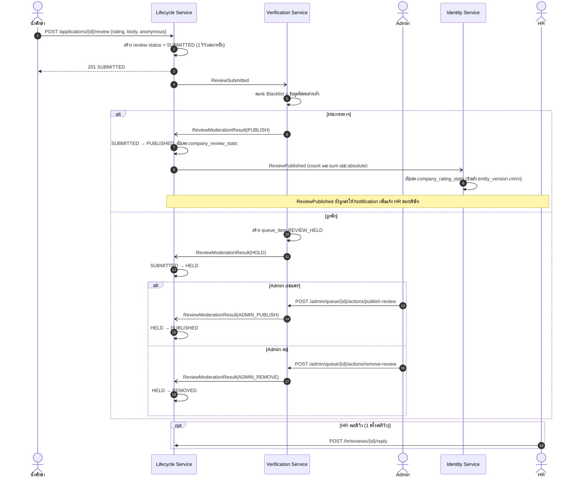
```mermaid
sequenceDiagram
    autonumber
    actor S as นักศึกษา
    participant L as Lifecycle Service
    participant V as Verification Service
    actor AD as Admin
    participant I as Identity Service
    actor H as HR

    S->>L: POST /applications/{id}/review {rating, body, anonymous}
    L->>L: สร้าง review status = SUBMITTED (1 รีวิวต่อการฝึก)
    L-->>S: 201 SUBMITTED
    L-)V: ReviewSubmitted
    V->>V: สแกน Blacklist + ข้อมูลติดต่อส่วนตัว

    alt ผ่านการตรวจ
        V-)L: ReviewModerationResult(PUBLISH)
        L->>L: SUBMITTED → PUBLISHED, อัปเดต company_review_stats
        L-)I: ReviewPublished (count และ sum แบบ absolute)
        I->>I: อัปเดต company_rating_stats (ข้ามถ้า entity_version เก่ากว่า)
        Note over L,H: ReviewPublished ยังถูกส่งให้ Notification เพื่อแจ้ง HR ของบริษัท
    else ถูกพัก
        V->>V: สร้าง queue_item REVIEW_HELD
        V-)L: ReviewModerationResult(HOLD)
        L->>L: SUBMITTED → HELD
        alt Admin เผยแพร่
            AD->>V: POST /admin/queue/{id}/actions/publish-review
            V-)L: ReviewModerationResult(ADMIN_PUBLISH)
            L->>L: HELD → PUBLISHED
        else Admin ลบ
            AD->>V: POST /admin/queue/{id}/actions/remove-review
            V-)L: ReviewModerationResult(ADMIN_REMOVE)
            L->>L: HELD → REMOVED
        end
    end

    opt HR ตอบรีวิว (1 ครั้งต่อรีวิว)
        H->>L: POST /hr/reviews/{id}/reply
    end
```

---

## 3. Class Diagram

แสดง **Domain Model** (ชื่อ Class = เอนทิตีธุรกิจ, เมธอด = Action ที่เปลี่ยนสถานะตาม State Machine) — รายละเอียดคอลัมน์/ดัชนีอยู่ใน ER (§4) • เส้นประ `..>` = อ้างข้าม Service ด้วย ID

### 3.1 Identity & Organization

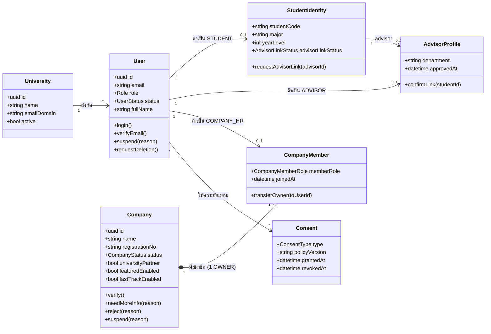
```mermaid
classDiagram
    direction LR

    class University {
        +uuid id
        +string name
        +string emailDomain
        +bool active
    }
    class User {
        +uuid id
        +string email
        +Role role
        +UserStatus status
        +string fullName
        +login()
        +verifyEmail()
        +suspend(reason)
        +requestDeletion()
    }
    class StudentIdentity {
        +string studentCode
        +string major
        +int yearLevel
        +AdvisorLinkStatus advisorLinkStatus
        +requestAdvisorLink(advisorId)
    }
    class AdvisorProfile {
        +string department
        +datetime approvedAt
        +confirmLink(studentId)
    }
    class Company {
        +uuid id
        +string name
        +string registrationNo
        +CompanyStatus status
        +bool universityPartner
        +bool featuredEnabled
        +bool fastTrackEnabled
        +verify()
        +needMoreInfo(reason)
        +reject(reason)
        +suspend(reason)
    }
    class CompanyMember {
        +CompanyMemberRole memberRole
        +datetime joinedAt
        +transferOwner(toUserId)
    }
    class Consent {
        +ConsentType type
        +string policyVersion
        +datetime grantedAt
        +datetime revokedAt
    }

    University "1" --> "*" User : สังกัด
    User "1" --> "0..1" StudentIdentity : ถ้าเป็น STUDENT
    User "1" --> "0..1" AdvisorProfile : ถ้าเป็น ADVISOR
    User "1" --> "0..1" CompanyMember : ถ้าเป็น COMPANY_HR
    Company "1" *-- "1..*" CompanyMember : มีสมาชิก (1 OWNER)
    User "1" --> "*" Consent : ให้ความยินยอม
    StudentIdentity "*" --> "0..1" AdvisorProfile : advisor
```

### 3.2 Job Management & Verification

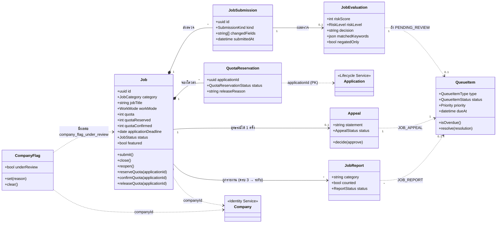
```mermaid
classDiagram
    direction LR

    class Job {
        +uuid id
        +JobCategory category
        +string jobTitle
        +WorkMode workMode
        +int quota
        +int quotaReserved
        +int quotaConfirmed
        +date applicationDeadline
        +JobStatus status
        +bool featured
        +submit()
        +close()
        +reopen()
        +reserveQuota(applicationId)
        +confirmQuota(applicationId)
        +releaseQuota(applicationId)
    }
    class JobSubmission {
        +uuid id
        +SubmissionKind kind
        +string[] changedFields
        +datetime submittedAt
    }
    class QuotaReservation {
        +uuid applicationId
        +QuotaReservationStatus status
        +string releaseReason
    }
    class JobEvaluation {
        +int riskScore
        +RiskLevel riskLevel
        +string decision
        +json matchedKeywords
        +bool negatedOnly
    }
    class Appeal {
        +string statement
        +AppealStatus status
        +decide(approve)
    }
    class QueueItem {
        +QueueItemType type
        +QueueItemStatus status
        +Priority priority
        +datetime dueAt
        +isOverdue()
        +resolve(resolution)
    }
    class JobReport {
        +string category
        +bool counted
        +ReportStatus status
    }
    class CompanyFlag {
        +bool underReview
        +set(reason)
        +clear()
    }

    Job "1" *-- "*" JobSubmission : ส่งตรวจ
    Job "1" *-- "*" QuotaReservation : จองโควตา
    JobSubmission "1" --> "0..1" JobEvaluation : ผลตรวจ
    Job "1" --> "0..1" Appeal : อุทธรณ์ได้ 1 ครั้ง
    JobEvaluation "1" ..> "0..1" QueueItem : ถ้า PENDING_REVIEW
    Appeal "1" ..> "1" QueueItem : JOB_APPEAL
    Job "1" --> "*" JobReport : ถูกรายงาน (ครบ 3 → ระงับ)
    JobReport "*" ..> "0..1" QueueItem : JOB_REPORT
    CompanyFlag ..> Job : มีผลต่อ company_flag_under_review

    class Application {
        <<Lifecycle Service>>
    }
    class Company {
        <<Identity Service>>
    }
    QuotaReservation ..> Application : applicationId (PK)
    Job ..> Company : companyId
    CompanyFlag ..> Company : companyId
```

### 3.3 Student Experience & Internship Lifecycle

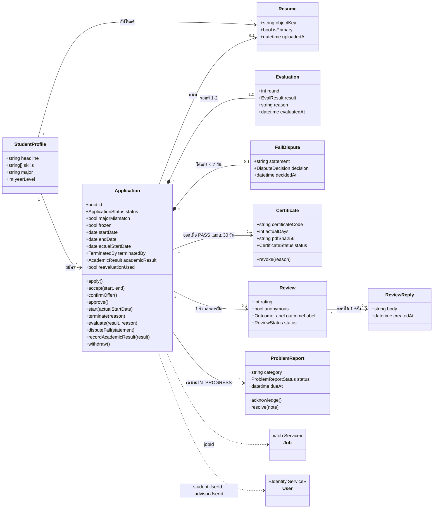
```mermaid
classDiagram
    direction LR

    class StudentProfile {
        +string headline
        +string[] skills
        +string major
        +int yearLevel
    }
    class Resume {
        +string objectKey
        +bool isPrimary
        +datetime uploadedAt
    }
    class Application {
        +uuid id
        +ApplicationStatus status
        +bool majorMismatch
        +bool frozen
        +date startDate
        +date endDate
        +date actualStartDate
        +TerminatedBy terminatedBy
        +AcademicResult academicResult
        +bool reevaluationUsed
        +apply()
        +accept(start, end)
        +confirmOffer()
        +approve()
        +start(actualStartDate)
        +terminate(reason)
        +evaluate(result, reason)
        +disputeFail(statement)
        +recordAcademicResult(result)
        +withdraw()
    }
    class Evaluation {
        +int round
        +EvalResult result
        +string reason
        +datetime evaluatedAt
    }
    class FailDispute {
        +string statement
        +DisputeDecision decision
        +datetime decidedAt
    }
    class Certificate {
        +string certificateCode
        +int actualDays
        +string pdfSha256
        +CertificateStatus status
        +revoke(reason)
    }
    class Review {
        +int rating
        +bool anonymous
        +OutcomeLabel outcomeLabel
        +ReviewStatus status
    }
    class ReviewReply {
        +string body
        +datetime createdAt
    }
    class ProblemReport {
        +string category
        +ProblemReportStatus status
        +datetime dueAt
        +acknowledge()
        +resolve(note)
    }

    StudentProfile "1" --> "*" Resume : อัปโหลด
    StudentProfile "1" --> "*" Application : สมัคร
    Application "*" --> "0..1" Resume : แนบ
    Application "1" *-- "1..2" Evaluation : รอบที่ 1-2
    Application "1" *-- "0..1" FailDispute : โต้แย้ง ≤ 7 วัน
    Application "1" --> "0..1" Certificate : ออกเมื่อ PASS และ ≥ 30 วัน
    Application "1" --> "0..1" Review : 1 รีวิวต่อการฝึก
    Review "1" --> "0..1" ReviewReply : ตอบได้ 1 ครั้ง
    Application "1" --> "*" ProblemReport : เฉพาะ IN_PROGRESS

    class Job {
        <<Job Service>>
    }
    class User {
        <<Identity Service>>
    }
    Application ..> Job : jobId
    Application ..> User : studentUserId, advisorUserId
```

---

## 4. ER Diagram

ตารางและคอลัมน์ตาม [data-schema.md](data-schema.md) — แสดงเฉพาะคอลัมน์สำคัญ (PK/FK/ที่ใช้เป็นเงื่อนไข) • ข้อความในเครื่องหมายคำพูดท้ายคอลัมน์คือหมายเหตุ/ข้อจำกัด

### 4.0 ภาพรวมการอ้างอิงข้าม Service (ไม่ใช่ FK)

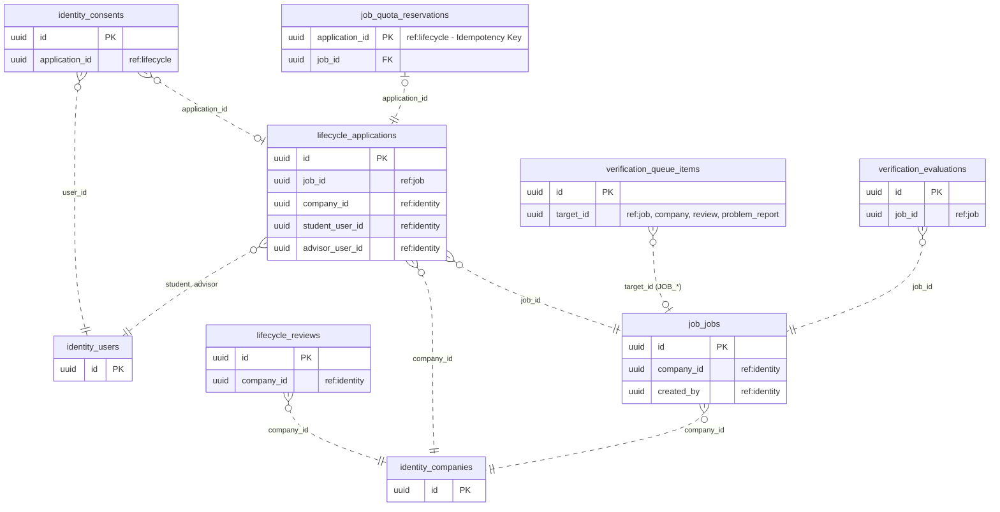
```mermaid
erDiagram
    identity_users {
        uuid id PK
    }
    identity_companies {
        uuid id PK
    }
    identity_consents {
        uuid id PK
        uuid application_id "ref:lifecycle"
    }
    job_jobs {
        uuid id PK
        uuid company_id "ref:identity"
        uuid created_by "ref:identity"
    }
    job_quota_reservations {
        uuid application_id PK "ref:lifecycle - Idempotency Key"
        uuid job_id FK
    }
    verification_evaluations {
        uuid id PK
        uuid job_id "ref:job"
    }
    verification_queue_items {
        uuid id PK
        uuid target_id "ref:job, company, review, problem_report"
    }
    lifecycle_applications {
        uuid id PK
        uuid job_id "ref:job"
        uuid company_id "ref:identity"
        uuid student_user_id "ref:identity"
        uuid advisor_user_id "ref:identity"
    }
    lifecycle_reviews {
        uuid id PK
        uuid company_id "ref:identity"
    }

    job_jobs }o..|| identity_companies : "company_id"
    job_quota_reservations |o..|| lifecycle_applications : "application_id"
    verification_evaluations }o..|| job_jobs : "job_id"
    verification_queue_items }o..o| job_jobs : "target_id (JOB_*)"
    lifecycle_applications }o..|| job_jobs : "job_id"
    lifecycle_applications }o..|| identity_companies : "company_id"
    lifecycle_applications }o..|| identity_users : "student, advisor"
    lifecycle_reviews }o..|| identity_companies : "company_id"
    identity_consents }o..o| lifecycle_applications : "application_id"
    identity_consents }o..|| identity_users : "user_id"
```

### 4.1 Identity & Organization (`identity_db`)

```mermaid
erDiagram
    universities ||--o{ users : "university_id"
    users ||--o| student_profiles_identity : "user_id"
    users ||--o| advisor_profiles : "user_id"
    users ||--o{ student_profiles_identity : "advisor_id"
    companies ||--o{ company_members : "company_id"
    users ||--o| company_members : "user_id (unique)"
    companies ||--o{ company_invitations : "company_id"
    companies ||--o{ company_documents : "company_id"
    companies ||--o{ owner_transfers : "company_id"
    companies ||--o| company_rating_stats : "company_id"
    users ||--o{ consents : "user_id"
    users ||--o{ refresh_tokens : "user_id"
    users ||--o{ email_tokens : "user_id"
    users ||--o{ deletion_requests : "user_id"

    universities {
        uuid id PK
        text name
        text email_domain UK
        bool active
    }
    users {
        uuid id PK
        citext email UK
        text password_hash "argon2id"
        Role role
        UserStatus status
        uuid university_id FK
        text full_name "PII - Anonymize ตอนลบ"
        int version
    }
    student_profiles_identity {
        uuid user_id PK, FK
        text student_code
        text major
        int year_level
        uuid advisor_id FK
        AdvisorLinkStatus advisor_link_status
        uuid pending_advisor_id
    }
    advisor_profiles {
        uuid user_id PK, FK
        text department
        uuid approved_by
        timestamptz approved_at
    }
    companies {
        uuid id PK
        text name
        text registration_no UK "เลขนิติบุคคล"
        text email_domain
        CompanyStatus status
        bool university_partner
        bool featured_enabled
        bool fast_track_enabled
        int version
    }
    company_members {
        uuid id PK
        uuid company_id FK
        uuid user_id FK, UK
        CompanyMemberRole member_role "1 OWNER ต่อบริษัท (partial unique)"
    }
    company_invitations {
        uuid id PK
        uuid company_id FK
        text email
        text token_hash
        timestamptz expires_at
    }
    company_documents {
        uuid id PK
        uuid company_id FK
        text doc_type
        text object_key "Private bucket"
    }
    owner_transfers {
        uuid id PK
        uuid company_id FK
        uuid from_user_id FK
        uuid to_user_id FK
        text status "PENDING, ACCEPTED, CANCELLED, EXPIRED"
    }
    company_rating_stats {
        uuid company_id PK, FK
        int review_count
        int rating_sum
        int entity_version "จาก ReviewPublished"
    }
    consents {
        uuid id PK
        uuid user_id FK
        text type "PRIVACY_POLICY, RESUME_SHARE"
        uuid target_company_id
        uuid application_id "ref:lifecycle"
        timestamptz revoked_at
    }
    refresh_tokens {
        uuid id PK
        uuid user_id FK
        text token_hash
        uuid family_id
        timestamptz rotated_at
        timestamptz revoked_at
    }
    email_tokens {
        uuid id PK
        uuid user_id FK
        text purpose "VERIFY_EMAIL, RESET_PASSWORD"
        timestamptz used_at
    }
    deletion_requests {
        uuid id PK
        uuid user_id FK
        text status "REQUESTED, BLOCKED, COMPLETED"
    }
```

### 4.2 Job Management (`job_db`)

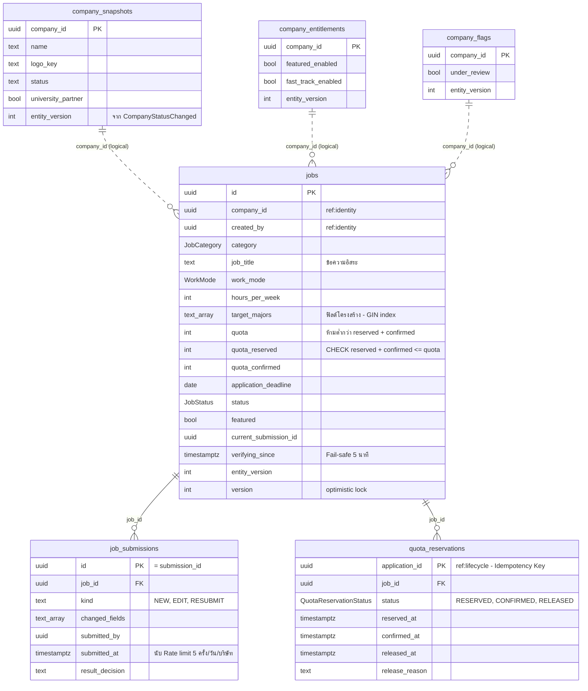
```mermaid
erDiagram
    jobs ||--o{ job_submissions : "job_id"
    jobs ||--o{ quota_reservations : "job_id"
    company_snapshots ||..o{ jobs : "company_id (logical)"
    company_entitlements ||..o{ jobs : "company_id (logical)"
    company_flags ||..o{ jobs : "company_id (logical)"

    jobs {
        uuid id PK
        uuid company_id "ref:identity"
        uuid created_by "ref:identity"
        JobCategory category
        text job_title "ข้อความอิสระ"
        WorkMode work_mode
        int hours_per_week
        text_array target_majors "ฟิลด์โครงสร้าง - GIN index"
        int quota "ห้ามต่ำกว่า reserved + confirmed"
        int quota_reserved "CHECK reserved + confirmed <= quota"
        int quota_confirmed
        date application_deadline
        JobStatus status
        bool featured
        uuid current_submission_id
        timestamptz verifying_since "Fail-safe 5 นาที"
        int entity_version
        int version "optimistic lock"
    }
    job_submissions {
        uuid id PK "= submission_id"
        uuid job_id FK
        text kind "NEW, EDIT, RESUBMIT"
        text_array changed_fields
        uuid submitted_by
        timestamptz submitted_at "นับ Rate limit 5 ครั้ง/วัน/บริษัท"
        text result_decision
    }
    quota_reservations {
        uuid application_id PK "ref:lifecycle - Idempotency Key"
        uuid job_id FK
        QuotaReservationStatus status "RESERVED, CONFIRMED, RELEASED"
        timestamptz reserved_at
        timestamptz confirmed_at
        timestamptz released_at
        text release_reason
    }
    company_snapshots {
        uuid company_id PK
        text name
        text logo_key
        text status
        bool university_partner
        int entity_version "จาก CompanyStatusChanged"
    }
    company_entitlements {
        uuid company_id PK
        bool featured_enabled
        bool fast_track_enabled
        int entity_version
    }
    company_flags {
        uuid company_id PK
        bool under_review
        int entity_version
    }
```

### 4.3 Verification & Trust (`verification_db`)

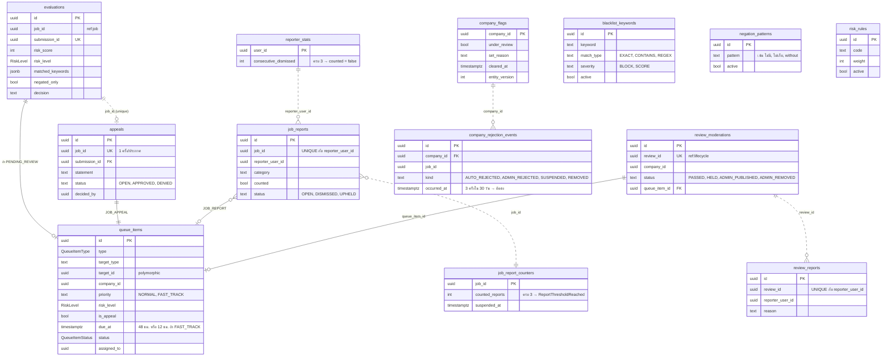
```mermaid
erDiagram
    evaluations ||..o| appeals : "job_id (unique)"
    evaluations ||--o| queue_items : "ถ้า PENDING_REVIEW"
    appeals ||--|| queue_items : "JOB_APPEAL"
    job_reports }o..|| job_report_counters : "job_id"
    job_reports }o--o| queue_items : "JOB_REPORT"
    reporter_stats ||..o{ job_reports : "reporter_user_id"
    review_moderations ||--o| queue_items : "queue_item_id"
    review_moderations ||..o{ review_reports : "review_id"
    company_flags ||..o{ company_rejection_events : "company_id"

    blacklist_keywords {
        uuid id PK
        text keyword
        text match_type "EXACT, CONTAINS, REGEX"
        text severity "BLOCK, SCORE"
        bool active
    }
    negation_patterns {
        uuid id PK
        text pattern "เช่น ไม่มี, ไม่เก็บ, without"
        bool active
    }
    risk_rules {
        uuid id PK
        text code
        int weight
        bool active
    }
    evaluations {
        uuid id PK
        uuid job_id "ref:job"
        uuid submission_id UK
        int risk_score
        RiskLevel risk_level
        jsonb matched_keywords
        bool negated_only
        text decision
    }
    appeals {
        uuid id PK
        uuid job_id UK "1 ครั้ง/ประกาศ"
        uuid submission_id FK
        text statement
        text status "OPEN, APPROVED, DENIED"
        uuid decided_by
    }
    queue_items {
        uuid id PK
        QueueItemType type
        text target_type
        uuid target_id "polymorphic"
        uuid company_id
        text priority "NORMAL, FAST_TRACK"
        RiskLevel risk_level
        bool is_appeal
        timestamptz due_at "48 ชม. หรือ 12 ชม. ถ้า FAST_TRACK"
        QueueItemStatus status
        uuid assigned_to
    }
    job_reports {
        uuid id PK
        uuid job_id "UNIQUE กับ reporter_user_id"
        uuid reporter_user_id
        text category
        bool counted
        text status "OPEN, DISMISSED, UPHELD"
    }
    job_report_counters {
        uuid job_id PK
        int counted_reports "ครบ 3 → ReportThresholdReached"
        timestamptz suspended_at
    }
    reporter_stats {
        uuid user_id PK
        int consecutive_dismissed "ครบ 3 → counted = false"
    }
    company_rejection_events {
        uuid id PK
        uuid company_id FK
        uuid job_id
        text kind "AUTO_REJECTED, ADMIN_REJECTED, SUSPENDED, REMOVED"
        timestamptz occurred_at "3 ครั้งใน 30 วัน → ติดธง"
    }
    company_flags {
        uuid company_id PK
        bool under_review
        text set_reason
        timestamptz cleared_at
        int entity_version
    }
    review_moderations {
        uuid id PK
        uuid review_id UK "ref:lifecycle"
        uuid company_id
        text status "PASSED, HELD, ADMIN_PUBLISHED, ADMIN_REMOVED"
        uuid queue_item_id FK
    }
    review_reports {
        uuid id PK
        uuid review_id "UNIQUE กับ reporter_user_id"
        uuid reporter_user_id
        text reason
    }
```

### 4.4 Student Experience & Internship Lifecycle (`lifecycle_db`)

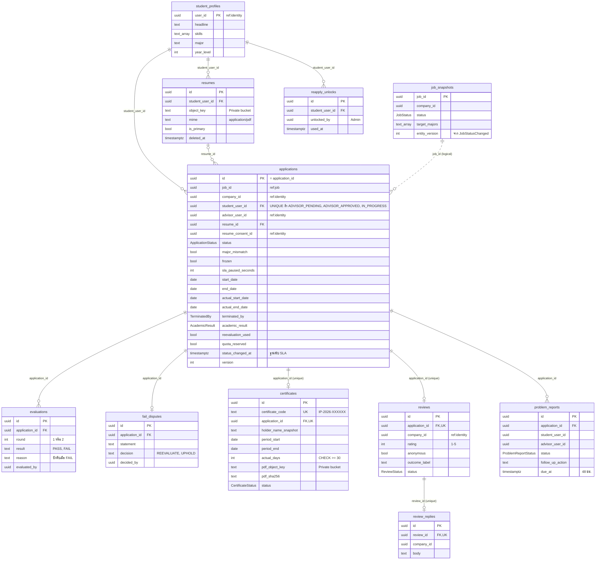
```mermaid
erDiagram
    student_profiles ||--o{ resumes : "student_user_id"
    student_profiles ||--o{ applications : "student_user_id"
    resumes |o--o{ applications : "resume_id"
    job_snapshots ||..o{ applications : "job_id (logical)"
    applications ||--o{ evaluations : "application_id"
    applications ||--o| fail_disputes : "application_id"
    applications ||--o| certificates : "application_id (unique)"
    applications ||--o| reviews : "application_id (unique)"
    reviews ||--o| review_replies : "review_id (unique)"
    applications ||--o{ problem_reports : "application_id"
    student_profiles ||--o{ reapply_unlocks : "student_user_id"

    student_profiles {
        uuid user_id PK "ref:identity"
        text headline
        text_array skills
        text major
        int year_level
    }
    resumes {
        uuid id PK
        uuid student_user_id FK
        text object_key "Private bucket"
        text mime "application/pdf"
        bool is_primary
        timestamptz deleted_at
    }
    job_snapshots {
        uuid job_id PK
        uuid company_id
        JobStatus status
        text_array target_majors
        int entity_version "จาก JobStatusChanged"
    }
    applications {
        uuid id PK "= application_id"
        uuid job_id "ref:job"
        uuid company_id "ref:identity"
        uuid student_user_id FK "UNIQUE ถ้า ADVISOR_PENDING, ADVISOR_APPROVED, IN_PROGRESS"
        uuid advisor_user_id "ref:identity"
        uuid resume_id FK
        uuid resume_consent_id "ref:identity"
        ApplicationStatus status
        bool major_mismatch
        bool frozen
        int sla_paused_seconds
        date start_date
        date end_date
        date actual_start_date
        date actual_end_date
        TerminatedBy terminated_by
        AcademicResult academic_result
        bool reevaluation_used
        bool quota_reserved
        timestamptz status_changed_at "ฐานนับ SLA"
        int version
    }
    evaluations {
        uuid id PK
        uuid application_id FK
        int round "1 หรือ 2"
        text result "PASS, FAIL"
        text reason "บังคับเมื่อ FAIL"
        uuid evaluated_by
    }
    fail_disputes {
        uuid id PK
        uuid application_id FK
        text statement
        text decision "REEVALUATE, UPHOLD"
        uuid decided_by
    }
    certificates {
        uuid id PK
        text certificate_code UK "IP-2026-XXXXXX"
        uuid application_id FK, UK
        text holder_name_snapshot
        date period_start
        date period_end
        int actual_days "CHECK >= 30"
        text pdf_object_key "Private bucket"
        text pdf_sha256
        CertificateStatus status
    }
    reviews {
        uuid id PK
        uuid application_id FK, UK
        uuid company_id "ref:identity"
        int rating "1-5"
        bool anonymous
        text outcome_label
        ReviewStatus status
    }
    review_replies {
        uuid id PK
        uuid review_id FK, UK
        uuid company_id
        text body
    }
    problem_reports {
        uuid id PK
        uuid application_id FK
        uuid student_user_id
        uuid advisor_user_id
        ProblemReportStatus status
        text follow_up_action
        timestamptz due_at "48 ชม."
    }
    reapply_unlocks {
        uuid id PK
        uuid student_user_id FK
        uuid unlocked_by "Admin"
        timestamptz used_at
    }
```

### 4.5 Notification (`notification_db`) และตารางร่วมทุก Service

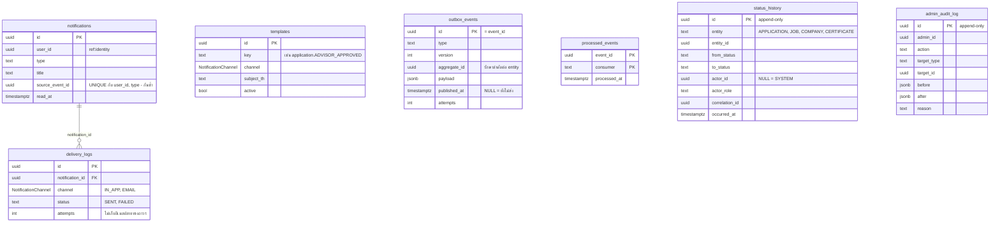
```mermaid
erDiagram
    notifications ||--o{ delivery_logs : "notification_id"

    notifications {
        uuid id PK
        uuid user_id "ref:identity"
        text type
        text title
        uuid source_event_id "UNIQUE กับ user_id, type - กันซ้ำ"
        timestamptz read_at
    }
    delivery_logs {
        uuid id PK
        uuid notification_id FK
        NotificationChannel channel "IN_APP, EMAIL"
        text status "SENT, FAILED"
        int attempts "ไม่เก็บอีเมลปลายทางถาวร"
    }
    templates {
        uuid id PK
        text key "เช่น application.ADVISOR_APPROVED"
        NotificationChannel channel
        text subject_th
        bool active
    }

    outbox_events {
        uuid id PK "= event_id"
        text type
        int version
        uuid aggregate_id "รักษาลำดับต่อ entity"
        jsonb payload
        timestamptz published_at "NULL = ยังไม่ส่ง"
        int attempts
    }
    processed_events {
        uuid event_id PK
        text consumer PK
        timestamptz processed_at
    }
    status_history {
        uuid id PK "append-only"
        text entity "APPLICATION, JOB, COMPANY, CERTIFICATE"
        uuid entity_id
        text from_status
        text to_status
        uuid actor_id "NULL = SYSTEM"
        text actor_role
        uuid correlation_id
        timestamptz occurred_at
    }
    admin_audit_log {
        uuid id PK "append-only"
        uuid admin_id
        text action
        text target_type
        uuid target_id
        jsonb before
        jsonb after
        text reason
    }
```

> `outbox_events`, `processed_events`, `status_history` มีใน **ทุก Service** (ยกเว้น Notification ที่ไม่ต้องมี `status_history`), `admin_audit_log` มีใน Service ที่ Admin ทำรายการ — ดู [data-schema.md §2.2](data-schema.md)
